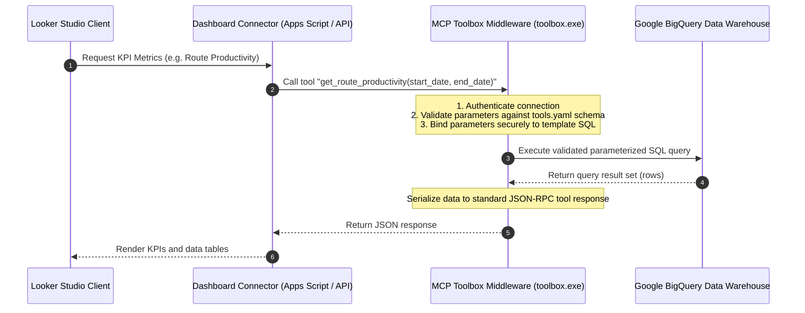

# Data Design — LM-007 (Dashboard & Strategic Narrative)

This document outlines the visual structure, layout mockups, KPI definitions, and narrative outlines designed to satisfy requirements `A1` through `A11` for the Dashboard & Strategic Narrative.

## 1. Target Structure of the Final Report

The final report `Reports/Question_7_Dashboard_Strategic_Narrative.md` will be structured in Spanish and include:
1. **Título y Metadatos**: Control de versión, autor, fecha.
2. **Resumen Ejecutivo**: Una síntesis ejecutiva de la operación regional (Q1-Q6) y las principales advertencias de calidad de datos.
3. **Sección Visual: Mockup de Dashboard Operativo**:
   - Representación ASCII detallada del tablero corporativo.
   - Detalle de KPIs globales y filtros interactivos.
   - Pestañas/secciones visuales dedicadas.
4. **Narrativa Estratégica (Historias Operativas - Problema -> Evidencia -> Acción)**:
   - **Historia A**: La Crisis de Capacidad y Subutilización en el Cono Sur (Argentina y Chile).
   - **Historia B**: Latencia en el Despacho de Almacenes y Brecha de Cumplimiento (OTH).
   - **Historia C**: La Ilusión de la Zona Horaria y el Bug de Ingesta (Corrupción de Logs).
   - **Historia D**: Violación Contractual Crítica y Exclusión Analítica (PT-014 - SaoPauloShip).
5. **Matriz de Recomendaciones Estratégicas**:
   - Tabla que resume las acciones operativas, impacto esperado, KPIs de control y prioridad.

---

## 2. Dashboard Mockup Layouts (ASCII Wireframes)

### A. Tablero Global: Vista de Control Operativo (KPI Summary & Region Performance)
```
+--------------------------------------------------------------------------------------------------+
| MERCADO LIBRE LOGÍSTICA  --  TABLERO GLOBAL DE RENDIMIENTO DE ÚLTIMA MILLA (ABRIL-MAYO 2025)     |
+--------------------------------------------------------------------------------------------------+
| Filtros: [ Rango Fechas: 01/04/2025 - 31/05/2025 ]  [ País: Todos ]  [ Hubs: Todos ]             |
|          [ Transportista: Todos (PT-014 EXCLUIDO) ] [ Vehículo: Todos ]                          |
+--------------------------------------------------------------------------------------------------+
|                                    TARJETAS DE CONTROLES GLOBAL                                  |
|  +-------------------+  +-------------------+  +-------------------+  +-------------------+      |
|  | Efic. de Paradas  |  | Utiliz. Capacidad |  | Éxito de Entregas |  | OTH Finalización  |      |
|  |     90.28%        |  |     60.03%        |  |     80.98%        |  |     45.20%        |      |
|  +-------------------+  +-------------------+  +-------------------+  +-------------------+      |
|  | OTH por Duración  |  | Brecha OTH (Gap)  |  | Tasa Error Datos  |  | Proveedores Act.  |      |
|  |     50.15%        |  |    +4.95 p.p.     |  |     0.53% (corrupt|  |       54 / 55     |      |
|  +-------------------+  +-------------------+  +-------------------+  +-------------------+      |
+--------------------------------------------------------------------------------------------------+
|                              RENDIMIENTO LOGÍSTICO POR PAÍS DE LA RED                            |
|                                                                                                  |
|  País  Rutas    Paradas Plan.  Paradas Reales  Efic. Paradas  Envíos Ent. Capacidad   Util. Cap. |
|  ----+ -------- -------------- -------------- -------------- ----------- ----------- ---------- |
|   PE    1,025       14,460         13,103         90.62%       13,094      16,514     79.29%     |
|   CO    3,128       55,247         50,015         90.53%       49,941      63,331     78.86%     |
|   MX    4,145       97,633         88,197         90.34%       87,975     122,884     71.59%     |
|   BR    6,445      427,841        386,490         90.33%      384,814     592,031     65.00%     |
|   CL    1,441       57,825         52,099         90.10%       51,916     101,417     51.19%     |
|   AR    3,851      282,577        254,556         90.08%      253,177     524,900     48.23%     |
+--------------------------------------------------------------------------------------------------+
```

### B. Pestaña de Diagnóstico: Telemetría, Zona Horaria y Calidad de Datos
```
+--------------------------------------------------------------------------------------------------+
| PESTAÑA: ANÁLISIS DE TELEMETRÍA Y CALIDAD DE DATOS                                               |
+--------------------------------------------------------------------------------------------------+
| ALERTA CRÍTICA: Columna "event_hour_utc" presenta 85.29% de registros corruptos en producción.    |
|                 El sistema utiliza cálculo dinámico basado en event_timestamp en hora local.     |
+--------------------------------------------------------------------------------------------------+
|                 ANÁLISIS DE ENTREGAS TARDÍAS: LA ILUSIÓN DE LA ZONA HORARIA                      |
|                                                                                                  |
|  País   Huso   Envíos Entregados  Tasa Tardía UTC (>=20:00)  Tasa Tardía Local Real (>=20:00)      |
|  ----  -----  ------------------  -------------------------  ------------------------------      |
|   MX     -6         82,446                  0.55%                        5.64% [Foco Alerta]     |
|   PE     -5         12,962                  0.64%                        3.94% [Moderado]        |
|   CO     -5         48,013                  0.47%                        3.12% [Seguro]          |
|   CL     -4         46,170                  0.61%                        1.13% [Seguro]          |
|   AR     -3        222,423                  0.57%                        0.73% [Seguro]          |
|   BR     -3        344,165                  0.51%                        0.73% [Seguro]          |
+--------------------------------------------------------------------------------------------------+
|                 VISUALIZACIÓN DE CORRUPCIÓN EN LA COLUMNA event_hour_utc                         |
|  Hora Real UTC (Extract)   Hora en Columna Precalculada    Fila Auditada   % de Datos Corruptos  |
|  -----------------------   ----------------------------    -------------   --------------------  |
|         18:00                         18:00                   130,948              0.00%         |
|         19:00                         19:00                    62,071              0.00%         |
|         20:00                         00:00 [CORRUPTO]         22,610            100.00% [!]     |
|         21:00                         00:00 [CORRUPTO]          5,988            100.00% [!]     |
|         22:00                         00:00 [CORRUPTO]          4,977            100.00% [!]     |
|         23:00                         00:00 [CORRUPTO]          5,353            100.00% [!]     |
+--------------------------------------------------------------------------------------------------+
```

### C. Pestaña de Cumplimiento de Horarios y Brechas (OTH & Gap Analysis)
```
+--------------------------------------------------------------------------------------------------+
| PESTAÑA: ANÁLISIS DE CUMPLIMIENTO DE HORARIOS (ON-TIME HANDLING)                                 |
+--------------------------------------------------------------------------------------------------+
| Resumen de Gap: OTH por Duración vs OTH Hora de Fin. Gap positivo indica demoras de despacho.    |
+--------------------------------------------------------------------------------------------------+
|                 ANÁLISIS DE CUMPLIMIENTO HORARIO SEGÚN HORA PROGRAMADA DE FIN (RED)              |
|  Hora Fin Plan.   Rutas Totales   OTH Hora Fin (%)   OTH Duración (%)   Gap (p.p.)               |
|  --------------   -------------   ----------------   ----------------   ----------               |
|      11:00            601.0            35.44%             39.93%         +4.49 p.p.              |
|      12:00            680.0            36.62%             43.68%         +7.06 p.p. [Despacho]   |
|      15:00            928.0            42.89%             47.52%         +4.63 p.p.              |
|      18:00          1,411.0            45.07%             49.68%         +4.61 p.p.              |
|      20:00            863.0            53.30%             61.30%         +8.00 p.p.              |
|      22:00            752.0            72.87%             73.54%         +0.67 p.p.              |
+--------------------------------------------------------------------------------------------------+
|                 EJEMPLOS CLAVE DE RETRASO DE DESPACHO EN FLOTAS CRÍTICAS                         |
|  País  Transportista        Vehículo      Rutas   OTH Hora Fin  OTH Duración   Gap (p.p.)        |
|  ----  -----------------  ------------  --------  ------------  ------------  -----------        |
|   BR   Rio Express        Van (Large)       81        64.20%        76.54%    +12.34 p.p. [Alert] |
|   CL   Chile Express      Van (Medium)      54        33.33%        46.30%    +12.97 p.p. [Alert] |
|   AR   RosarioShip        Van (Large)      217        49.31%        57.60%     +8.29 p.p.        |
+--------------------------------------------------------------------------------------------------+
```

### D. Pestaña de Consistencia, Auditoría Contractual y Exclusiones (PT-014)
```
+--------------------------------------------------------------------------------------------------+
| PESTAÑA: GOBERNANZA DE PROVEEDORES Y AUDITORÍA DE PT-014 (SAOPAULOSHIP)                          |
+--------------------------------------------------------------------------------------------------+
| REGLA DE EXCLUSIÓN (A8): Si la tasa de error operativo > 5%, excluir de reportes oficiales.     |
+--------------------------------------------------------------------------------------------------+
|                           AUDITORÍA OPERATIVA DE SAOPAULOSHIP (PT-014)                           |
|  * Rutas Totales Asignadas: 378                                                                  |
|  * Rutas Stale (No Cerradas): 29 (7.67% de error)                                                |
|  * Rutas con Cronología Invertida: 152 (43.55% de error sobre completadas)                       |
|  * Fallas de Sincronización GPS (NULLs): 61 (17.48% de error)                                    |
|  * Rutas con Solapamiento Multihub: 38 (Imposibilidad física)                                    |
|  * Asignaciones Imposibles de Vehículos: 15 (Falta de control)                                   |
|  * TASA COMBINADA DE ERROR OPERATIVO: 51.85%  (Umbral Tolerancia: 5.00%)  -->  [🔴 EXCLUIDO]      |
+--------------------------------------------------------------------------------------------------+
|                           AUDITORÍA CONTRACTUAL Y CUMPLIMIENTO LEGAL                             |
|  * Estado del Proveedor: INACTIVO (active_flag = 0)                                              |
|  * Fecha de Vencimiento de Contrato: 31 de Octubre de 2024                                       |
|  * Rutas Operadas sin Contrato Vigente (Abril-Mayo 2025): 378 (100.00% de la operación)          |
|  * Riesgo Identificado: Falla crítica de control transaccional en el TMS (Asignación Ilegal).    |
+--------------------------------------------------------------------------------------------------+
```

---

## 3. KPI Definitions and Reference Metrics Table

The following definitions and analytical parameters govern the metrics rendered in the dashboard and narrative:

| KPI | Formula / Calculation | Reference Value | Business Interpretation |
|---|---|---|---|
| **Stops Efficiency** (Eficiencia de Paradas) | `SUM(actual_stops) / SUM(estimated_stops)` | Red: **90.28%**<br>BR: **90.33%** | Mide qué proporción del plan de paradas diario del ruteador es ejecutado con éxito. |
| **Capacity Utilization** (Utilización de Capacidad) | `SUM(deduped_shipments) / SUM(max_capacity_units)` | AR: **48.23%** (Min)<br>CL: **51.19%**<br>PE: **79.29%** (Max) | Mide el aprovechamiento del volumen físico del vehículo. Revela sobredimensión de flota. |
| **Delivery Success Rate** (Efectividad de Entrega) | `COUNTIF(status='delivered') / COUNT(shipment_id)` | Red: **~80.8%**<br>CL: **81.26%** (Max)<br>PE: **80.58%** (Min) | Mide el porcentaje de paquetes entregados sobre el total despachado en rutas completadas. |
| **OTH End Time** (OTH Hora Fin) | `COUNTIF(actual_end <= planned_end) / COUNT(routes)` | Red: **~45%** (Horas pico de fin: ~35-46%) | Porcentaje de viajes que terminan a la hora comprometida o antes. |
| **OTH Duration** (OTH Duración) | `COUNTIF(actual_dur <= planned_dur) / COUNT(routes)` | Red: **~50%** | Porcentaje de viajes completados dentro del tiempo de viaje planificado. |
| **OTH Gap** (Brecha OTH) | `OTH Duration (%) - OTH End Time (%)` | Red: **+4.95 p.p.**<br>Max: **+12.34 p.p.** | Mide la latencia de salida de almacén. Gap positivo = salida tardía con velocidad normal en ruta. |
| **Carrier Error Rate** (Tasa Error de Carrier) | `(Stale + Chrono Violations + GPS Sync Failures) / Total Routes` | PT-014: **51.85%** | Mide la calidad de la telemetría enviada por el transportista. Umbral de exclusión: 5.0%. |

---

## 4. Narrative Sections Outline (Problema -> Evidencia -> Acción)

### Resumen Ejecutivo
- Síntesis de los principales focos operativos.
- Descargo de responsabilidad sobre la calidad y el carácter sintético de los datos (firmas estadísticas homogeneizadas).

### Historia A: La Crisis de Capacidad y Subutilización en el Cono Sur (Argentina y Chile)
- **Problema**: Fugas de eficiencia financiera debido a la asignación de vehículos con exceso de capacidad física para la densidad de entregas registrada, provocando que más de la mitad del espacio de carga disponible viaje vacío en Argentina y Chile.
- **Evidencia**: 
  - Argentina: Eficiencia de paradas del **90.08%** pero utilización de capacidad de tan solo **48.23%** sobre 524,900 unidades de capacidad.
  - Chile: Eficiencia de paradas del **90.10%** pero utilización de capacidad de **51.19%** sobre 101,417 unidades de capacidad.
  - Relación lineal estricta de 1 paquete por parada física (paquetes entregados vs paradas reales).
- **Acción**: 
  1. Reajustar la mezcla de flota (`fleet mix`) en el Cono Sur, reemplazando furgonetas medianas/grandes por vehículos más compactos o motocicletas.
  2. Implementar un agrupador de entregas (`load consolidation`) en el ruteador para permitir múltiples entregas por parada física (densificación).

### Historia B: Latencia en el Despacho de Almacenes y Brecha de Cumplimiento (OTH)
- **Problema**: Alta variabilidad y bajo cumplimiento de los cronogramas prometidos a clientes, impulsado principalmente por demoras operativas en el proceso de despacho y carga física en los centros de distribución (latencia de salida) más que por ineficiencias de tránsito en la calle.
- **Evidencia**:
  - Gaps de cumplimiento positivos en flotas de alto volumen (e.g. Rio Express en BR Van Large: **+12.34 p.p.**; Chile Express en CL Van Medium: **+12.97 p.p.**).
  - Los peores niveles de OTH ocurren en el rango horario de 11:00 a 18:00 (donde OTH End Time cae a **35.44%**), mientras que mejora sustancialmente a las 22:00 (**72.87%**) y 23:00 (**87.99%**).
- **Acción**:
  1. Realizar una auditoría física en los centros de distribución con mayores brechas operativas para rastrear los tiempos de preparación de la carga (picking & staging).
  2. Implementar marcas de tiempo obligatorias de salida del hub (`actual_departure_time`) en el sistema transaccional para aislar el OTH del almacén del OTH en tránsito.

### Historia C: La Ilusión de la Zona Horaria y el Bug de Ingesta (Corrupción de Logs)
- **Problema**: Alarmas innecesarias sobre jornadas de conducción peligrosas en horario nocturno en Brasil y Colombia, complementado por la imposibilidad de auditar correctamente el desempeño nocturno real debido a un fallo técnico persistente (bug) en el ETL del almacén de datos.
- **Evidencia**:
  - Tasa de entregas nocturnas UTC en Colombia (**0.47%**) y Brasil (**0.51%**). Al corregir la zona horaria a hora local, Colombia registra **3.12%** y Brasil **0.73%** (dentro de parámetros seguros).
  - México se revela como el foco real de riesgo con **5.64%** de entregas nocturnas locales, seguido de Perú con **3.94%**.
  - Corrupción del **100.00%** en la columna `event_hour_utc` para cualquier evento ocurrido entre las 20:00 y las 23:59 UTC, donde la columna fuerza el valor a `0`. Esto afecta a 38,928 registros en producción.
- **Acción**:
  1. Alinear con el equipo de ingeniería de datos para corregir el bug de truncamiento en el script de transformación horaria del ETL.
  2. Adoptar marcas de tiempo locales en hora local real (`TIMESTAMP_ADD`) en todas las capas semánticas de BI.
  3. Rediseñar rutas en México para asegurar la finalización antes de las 20:00 hora local.

### Historia D: Violación Contractual Crítica y Exclusión Analítica (PT-014 - SaoPauloShip)
- **Problema**: Operación descontrolada de un transportista sin amparo legal/contractual activo, cuyos registros de telemetría e incidencias de tránsito contaminan y distorsionan gravemente el reporte consolidado regional de Brasil.
- **Evidencia**:
  - SaoPauloShip operó **378 rutas** en abril-mayo 2025 bajo un contrato vencido el **31/10/2024** y estando inactivo (`active_flag = 0`).
  - Tasa de error operativo combinada del **51.85%**: 29 rutas stale (7.67%), 152 rutas con cronología invertida (43.55%), 61 rutas sin GPS (17.48%), 70 solapamientos de ruta, 38 solapamientos multihub y 15 asignaciones de vehículo imposibles.
- **Acción**:
  1. **Excluir a PT-014 de manera definitiva** de todos los tableros analíticos estándar de SLA y OTH corporativos.
  2. Implementar un bloqueo automático en el sistema transaccional de despacho de rutas (TMS) para evitar la asignación de rutas a transportistas cuyo contrato haya expirado o estén marcados como inactivos.
  3. Iniciar una auditoría financiera inmediata sobre los pagos emitidos a PT-014 en 2025.

---

## 5. Looker Studio MCP Toolbox Integration & Middleware Architecture

To enforce data governance, restrict direct database access, and ensure that only audited, high-quality analytical queries are executed by dashboard clients, the reporting layer integrates the **Looker Studio MCP Toolbox** (`toolbox.exe`) as a secure middleware component between Google BigQuery and Looker / Looker Studio.

### A. Architectural Flow Diagram

The following sequence illustrates the secure data flow where dashboard clients query the data warehouse through the MCP server:



### B. Middleware Integration Benefits
- **Security**: No raw database access is exposed to the visualization layer. Queries are pre-configured, preventing arbitrary SQL execution or SQL injection.
- **Deduplication Enforcement**: The middleware ensures all queries run the standard dynamic deduplication logic (`ROW_NUMBER()` over partition) so Looker Studio cannot bypass data quality rules.
- **Log Corruption Mitigation**: The timezone/log corruption tool extracts the true UTC hour dynamically from timestamps, neutralizing the corrupt `event_hour_utc` column.

### C. Configuration Design: `tools.yaml`

The Looker Studio MCP Toolbox reads its tool definitions from `tools.yaml`. The schema defines the name, description, expected parameters, and the parameterized query. 

All SQL keywords inside the template queries MUST be fully capitalized to maintain standard style compliance.

```yaml
# tools.yaml
tools:
  - name: get_route_productivity
    description: "Retrieves stops efficiency and capacity utilization metrics grouped by country for completed delivery routes."
    parameters:
      type: object
      properties:
        start_date:
          type: string
          description: "Start date (YYYY-MM-DD) for route filtering"
        end_date:
          type: string
          description: "End date (YYYY-MM-DD) for route filtering"
      required:
        - start_date
        - end_date
    sql: |
      WITH deduped_shipments AS (
        SELECT 
          shipment_id,
          route_id
        FROM (
          SELECT 
            shipment_id,
            route_id,
            ROW_NUMBER() OVER(
              PARTITION BY shipment_id 
              ORDER BY status_change_timestamp DESC, delivery_attempt_count DESC
            ) AS rn
          FROM `meli-last-mile-sql-assessment.LAstmile.shipments_new`
        )
        WHERE rn = 1
      ),
      route_shipment_counts AS (
        SELECT 
          route_id, 
          COUNT(shipment_id) AS shipment_count
        FROM deduped_shipments
        GROUP BY route_id
      )
      SELECT 
        dc.country,
        COUNT(DISTINCT r.route_id) AS total_completed_routes,
        SUM(r.estimated_stops) AS total_estimated_stops,
        SUM(r.actual_stops) AS total_actual_stops,
        ROUND(SAFE_DIVIDE(SUM(r.actual_stops), SUM(r.estimated_stops)) * 100, 2) AS stops_efficiency_pct,
        SUM(s.shipment_count) AS total_shipments_carried,
        SUM(vt.max_capacity_units) AS total_max_capacity,
        ROUND(SAFE_DIVIDE(SUM(s.shipment_count), SUM(vt.max_capacity_units)) * 100, 2) AS capacity_utilization_pct
      FROM `meli-last-mile-sql-assessment.LAstmile.routes_new` AS r
      JOIN `meli-last-mile-sql-assessment.LAstmile.distribution_centers` AS dc 
        ON r.center_id = dc.center_id
      JOIN `meli-last-mile-sql-assessment.LAstmile.vehicle_types` AS vt 
        ON r.vehicle_type_id = vt.vehicle_type_id
      LEFT JOIN route_shipment_counts AS s 
        ON r.route_id = s.route_id
      WHERE r.route_type = 'DELIVERY'
        AND r.route_status = 'COMPLETED'
        AND r.route_date BETWEEN :start_date AND :end_date
      GROUP BY dc.country
      ORDER BY stops_efficiency_pct DESC;

  - name: get_delivery_effectiveness
    description: "Retrieves shipment counts, delivered shipment counts, and delivery success rates by country and partner carrier."
    parameters:
      type: object
      properties:
        start_date:
          type: string
          description: "Start date (YYYY-MM-DD) for route filtering"
        end_date:
          type: string
          description: "End date (YYYY-MM-DD) for route filtering"
      required:
        - start_date
        - end_date
    sql: |
      WITH deduped_shipments AS (
        SELECT 
          shipment_id, 
          route_id,
          last_status_detail
        FROM (
          SELECT 
            shipment_id, 
            route_id,
            last_status_detail,
            ROW_NUMBER() OVER(
              PARTITION BY shipment_id 
              ORDER BY status_change_timestamp DESC, delivery_attempt_count DESC
            ) AS rn
          FROM `meli-last-mile-sql-assessment.LAstmile.shipments_new`
        )
        WHERE rn = 1
      )
      SELECT 
        dc.country,
        r.partner_id,
        p.partner_name,
        COUNT(s.shipment_id) AS total_shipments,
        COUNT(CASE WHEN s.last_status_detail = 'delivered' THEN 1 END) AS delivered_shipments,
        ROUND(
          SAFE_DIVIDE(
            COUNT(CASE WHEN s.last_status_detail = 'delivered' THEN 1 END), 
            COUNT(s.shipment_id)
          ) * 100, 
          2
        ) AS success_rate_pct
      FROM deduped_shipments AS s
      JOIN `meli-last-mile-sql-assessment.LAstmile.routes_new` AS r
        ON s.route_id = r.route_id
      JOIN `meli-last-mile-sql-assessment.LAstmile.distribution_centers` AS dc
        ON r.center_id = dc.center_id
      JOIN `meli-last-mile-sql-assessment.LAstmile.partners` AS p
        ON r.partner_id = p.partner_id
      WHERE r.route_type = 'DELIVERY'
        AND r.route_status = 'COMPLETED'
        AND r.route_date BETWEEN :start_date AND :end_date
      GROUP BY dc.country, r.partner_id, p.partner_name
      ORDER BY dc.country ASC, success_rate_pct DESC;

  - name: get_oth_schedule_metrics
    description: "Retrieves On-Time Handling (OTH) metrics including OTH by End Time, OTH by Duration, and the OTH Gap by country, partner, and vehicle type."
    parameters:
      type: object
      properties:
        start_date:
          type: string
          description: "Start date (YYYY-MM-DD) for route filtering"
        end_date:
          type: string
          description: "End date (YYYY-MM-DD) for route filtering"
      required:
        - start_date
        - end_date
    sql: |
      SELECT 
        dc.country,
        r.partner_id,
        p.partner_name,
        vt.vehicle_type_name,
        EXTRACT(HOUR FROM r.planned_route_end_time) AS planned_end_hour,
        COUNT(r.route_id) AS total_routes,
        ROUND(SAFE_DIVIDE(COUNTIF(r.actual_route_end_time <= r.planned_route_end_time), COUNT(r.route_id)) * 100, 2) AS oth_end_time_pct,
        ROUND(SAFE_DIVIDE(COUNTIF(TIMESTAMP_DIFF(r.actual_route_end_time, r.actual_route_start_time, MINUTE) <= TIMESTAMP_DIFF(r.planned_route_end_time, r.planned_route_start_time, MINUTE)), COUNT(r.route_id)) * 100, 2) AS oth_duration_pct,
        ROUND(SAFE_DIVIDE(COUNTIF(TIMESTAMP_DIFF(r.actual_route_end_time, r.actual_route_start_time, MINUTE) <= TIMESTAMP_DIFF(r.planned_route_end_time, r.planned_route_start_time, MINUTE)), COUNT(r.route_id)) * 100, 2) -
        ROUND(SAFE_DIVIDE(COUNTIF(r.actual_route_end_time <= r.planned_route_end_time), COUNT(r.route_id)) * 100, 2) AS oth_metric_gap
      FROM `meli-last-mile-sql-assessment.LAstmile.routes_new` AS r
      JOIN `meli-last-mile-sql-assessment.LAstmile.partners` AS p 
        ON r.partner_id = p.partner_id
      JOIN `meli-last-mile-sql-assessment.LAstmile.vehicle_types` AS vt 
        ON r.vehicle_type_id = vt.vehicle_type_id
      JOIN `meli-last-mile-sql-assessment.LAstmile.distribution_centers` AS dc 
        ON r.center_id = dc.center_id
      WHERE r.route_type = 'DELIVERY'
        AND r.route_status = 'COMPLETED'
        AND r.route_date BETWEEN :start_date AND :end_date
        AND r.planned_route_start_time IS NOT NULL
        AND r.planned_route_end_time IS NOT NULL
        AND r.actual_route_start_time IS NOT NULL
        AND r.actual_route_end_time IS NOT NULL
        AND r.actual_route_end_time >= r.actual_route_start_time
        AND r.planned_route_end_time >= r.planned_route_start_time
      GROUP BY dc.country, r.partner_id, p.partner_name, vt.vehicle_type_name, planned_end_hour
      ORDER BY dc.country ASC, total_routes DESC;

  - name: get_timezone_log_corruption_metrics
    description: "Retrieves dynamic timezone-corrected delivery metrics and audits precalculated event hour log corruption."
    parameters:
      type: object
      properties:
        start_date:
          type: string
          description: "Start date (YYYY-MM-DD) for route filtering"
        end_date:
          type: string
          description: "End date (YYYY-MM-DD) for route filtering"
      required:
        - start_date
        - end_date
    sql: |
      WITH delivery_events AS (
        SELECT 
          dc.country,
          dc.timezone_offset,
          se.event_timestamp,
          EXTRACT(HOUR FROM se.event_timestamp) AS hour_utc,
          EXTRACT(HOUR FROM TIMESTAMP_ADD(se.event_timestamp, INTERVAL dc.timezone_offset HOUR)) AS hour_local,
          se.event_hour_utc AS logged_hour_utc
        FROM `meli-last-mile-sql-assessment.LAstmile.shipment_events_new` AS se
        JOIN `meli-last-mile-sql-assessment.LAstmile.routes_new` AS r
          ON se.route_id = r.route_id
        JOIN `meli-last-mile-sql-assessment.LAstmile.distribution_centers` AS dc
          ON r.center_id = dc.center_id
        WHERE se.event_type = 'delivered'
          AND r.route_type = 'DELIVERY'
          AND r.route_status = 'COMPLETED'
          AND r.route_date BETWEEN :start_date AND :end_date
      )
      SELECT 
        country,
        timezone_offset,
        COUNT(*) AS total_deliveries,
        COUNTIF(hour_utc >= 20) AS deliveries_utc_after_20,
        ROUND(SAFE_DIVIDE(COUNTIF(hour_utc >= 20), COUNT(*)) * 100, 2) AS pct_utc_after_20,
        COUNTIF(hour_local >= 20) AS deliveries_local_after_20,
        ROUND(SAFE_DIVIDE(COUNTIF(hour_local >= 20), COUNT(*)) * 100, 2) AS pct_local_after_20,
        COUNTIF(logged_hour_utc = 0 AND hour_utc >= 20) AS corrupt_records_count,
        ROUND(SAFE_DIVIDE(COUNTIF(logged_hour_utc = 0 AND hour_utc >= 20), COUNT(*)) * 100, 2) AS corruption_pct
      FROM delivery_events
      GROUP BY country, timezone_offset
      ORDER BY country ASC;

  - name: get_carrier_consistency_metrics
    description: "Profiles compliance, telemetry errors, stale routes, chronological violations, and contract expiration metrics for a given partner."
    parameters:
      type: object
      properties:
        partner_id:
          type: string
          description: "Unique partner identifier (e.g. PT-014)"
        start_date:
          type: string
          description: "Start date (YYYY-MM-DD) for route filtering"
        end_date:
          type: string
          description: "End date (YYYY-MM-DD) for route filtering"
      required:
        - partner_id
        - start_date
        - end_date
    sql: |
      WITH partner_routes AS (
        SELECT
          r.route_id,
          r.partner_id,
          r.route_status,
          r.route_date,
          r.center_id,
          r.vehicle_type_id,
          r.actual_route_start_time,
          r.actual_route_end_time,
          p.partner_name,
          p.active_flag,
          p.contract_end_date
        FROM `meli-last-mile-sql-assessment.LAstmile.routes_new` AS r
        INNER JOIN `meli-last-mile-sql-assessment.LAstmile.partners` AS p
          ON r.partner_id = p.partner_id
        WHERE r.partner_id = :partner_id
          AND r.route_date BETWEEN :start_date AND :end_date
      ),
      overlapping_routes AS (
        SELECT
          r1.route_id AS route_a_id,
          r2.route_id AS route_b_id,
          r1.center_id AS hub_a,
          r2.center_id AS hub_b,
          r1.vehicle_type_id AS vehicle_a,
          r2.vehicle_type_id AS vehicle_b
        FROM partner_routes AS r1
        INNER JOIN partner_routes AS r2
          ON r1.route_date = r2.route_date
          AND r1.route_id < r2.route_id
        WHERE r1.actual_route_start_time IS NOT NULL
          AND r1.actual_route_end_time IS NOT NULL
          AND r2.actual_route_start_time IS NOT NULL
          AND r2.actual_route_end_time IS NOT NULL
          AND r2.actual_route_start_time < r1.actual_route_end_time
          AND r2.actual_route_end_time > r1.actual_route_start_time
      )
      SELECT
        pr.partner_id,
        pr.partner_name,
        COUNT(DISTINCT pr.route_id) AS total_routes_assigned,
        COUNTIF(pr.route_status = 'IN_PROGRESS') AS stale_in_progress_count,
        ROUND(SAFE_DIVIDE(COUNTIF(pr.route_status = 'IN_PROGRESS'), COUNT(DISTINCT pr.route_id)) * 100, 2) AS stale_in_progress_pct,
        COUNTIF(pr.route_status = 'COMPLETED') AS completed_routes_count,
        COUNTIF(pr.route_status = 'COMPLETED' AND pr.actual_route_end_time < pr.actual_route_start_time) AS chrono_violations_count,
        ROUND(SAFE_DIVIDE(COUNTIF(pr.route_status = 'COMPLETED' AND pr.actual_route_end_time < pr.actual_route_start_time), COUNTIF(pr.route_status = 'COMPLETED')) * 100, 2) AS chrono_violations_pct,
        COUNTIF(pr.route_status = 'COMPLETED' AND (pr.actual_route_start_time IS NULL OR pr.actual_route_end_time IS NULL)) AS gps_sync_failures_count,
        ROUND(SAFE_DIVIDE(COUNTIF(pr.route_status = 'COMPLETED' AND (pr.actual_route_start_time IS NULL OR pr.actual_route_end_time IS NULL)), COUNTIF(pr.route_status = 'COMPLETED')) * 100, 2) AS gps_sync_failures_pct,
        (SELECT COUNT(DISTINCT route_a_id) + COUNT(DISTINCT route_b_id) FROM overlapping_routes) AS overlapping_routes_estimate,
        (SELECT COUNTIF(hub_a != hub_b) FROM overlapping_routes) AS multi_hub_overlaps_count,
        (SELECT COUNTIF(vehicle_a = vehicle_b AND hub_a != hub_b) FROM overlapping_routes) AS impossible_vehicle_allocations_count,
        COUNTIF(pr.route_date > pr.contract_end_date OR pr.active_flag = 0) AS contract_expired_routes_count,
        ROUND(SAFE_DIVIDE(COUNTIF(pr.route_date > pr.contract_end_date OR pr.active_flag = 0), COUNT(DISTINCT pr.route_id)) * 100, 2) AS contract_expired_routes_pct
      FROM partner_routes AS pr
      GROUP BY pr.partner_id, pr.partner_name;
```

